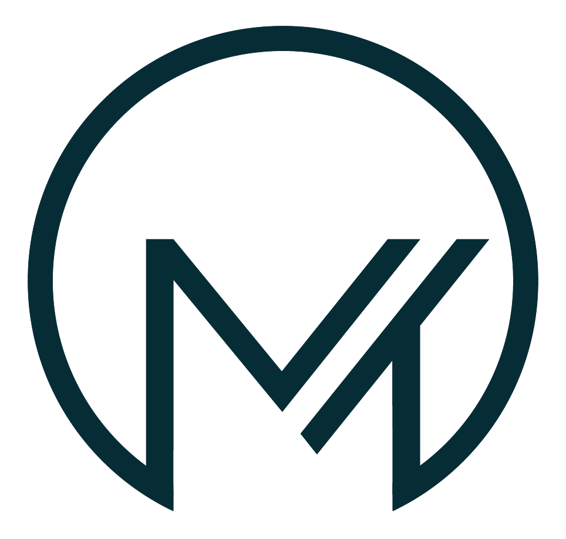

<p align="center">
  <picture>
    <source media="(prefers-color-scheme: dark)" srcset="app/assets/Mennenstech_logo_wit.png">
    <source media="(prefers-color-scheme: light)" srcset="app/assets/Mennenstech_logo.png">
    
  </picture>
  &nbsp;&nbsp;&nbsp;&nbsp;
  
</p>

<h1 align="center">MimiControl Studio</h1>

<p align="center">
  <strong>Gezichtsbesturing voor de computer</strong><br>
  Gebouwd door <a href="https://www.mennens.tech">Mennens.Tech</a>
</p>

<p align="center">
  <em>Let op: Dit project is gemaakt met behulp van AI (Claude/Cursor) en bevindt zich nog in de <strong>testfase</strong>. Gebruik op eigen risico. Feedback en bijdragen zijn welkom!</em>
</p>

---

## Wat is MimiControl?

MimiControl is een toegankelijkheidstool waarmee gebruikers hun computer kunnen bedienen via **gezichtsuitdrukkingen**. Oorspronkelijk ontwikkeld voor een leerling met zware spasmen die haar computer niet met handen kan bedienen.

De software herkent gezichtsbewegingen (zoals een lach, wenkbrauw optrekken, tong uitsteken) via de webcam en vertaalt deze naar toetsaanslagen — zodat de gebruiker programma's kan bedienen, kan scannen en keuzes kan maken.

---

## Versies

Het project is in drie stappen ontwikkeld, elk als uitbreiding op de vorige:

### v1 — MimiControl (CLI + Tkinter)
De eerste versie. Ondersteunt **één enkele trigger** (gezichtsuitdrukking → toetsaanslag).
- Kalibratie via video of webcam
- Configureerbare toets, cooldown en vasthoudtijd
- Anti-spasmefilter
- Tkinter GUI

**Starten:** `python app/mimicontrol.py` (CLI) of `python app/gui.py` (GUI)

### v2 — MimiMultiControl (CLI + Tkinter)
Uitbreiding met **meerdere triggers** (tot 3 verschillende gezichtsuitdrukkingen, elk gekoppeld aan een andere toets).
- Meerdere kalibraties
- Per trigger een eigen toets en drempel
- Tkinter GUI

**Starten:** `python app/mimimulticontrol.py` (CLI) of `python app/gui_multi.py` (GUI)

### v3 — MimiControl Studio (CustomTkinter)
De huidige hoofdversie. Volledig vernieuwde interface met **blendshape-detectie** en een visuele trigger-builder.
- Herkenning via 52 ARKit blendshapes (MediaPipe FaceLandmarker)
- Live Explorer: zie welke gezichtsmetingen uitslaan bij jouw gebaar
- Visuele trigger-editor: combineer meerdere blendshapes tot één trigger met individuele drempels
- Onbeperkt aantal triggers
- Moderne CustomTkinter GUI met Mennens.Tech branding
- Cooldown en vasthoudtijd instelbaar

**Starten:** `python app/mimiexplorer_ctk.py` of dubbelklik op `Start MimiControl Studio.bat`

---

## Snel starten

### Optie 1: Vanuit broncode (Python vereist)

```
1. Installeer Python 3.10+
2. Clone deze repository
3. Dubbelklik op "Start MimiControl Studio.bat"
```

Het script installeert automatisch alle dependencies en start de app.

### Optie 2: Kant-en-klare .exe (geen Python nodig)

Download `MimiControl Studio.exe` vanuit de [Releases](../../releases) pagina en dubbelklik om te starten.

> **Windows SmartScreen melding:** Bij de eerste keer openen kan Windows een blauw/rood scherm tonen met "Uw pc wordt beschermd". Dit is normaal — de .exe is niet digitaal ondertekend (geen code signing certificaat). Klik op **"Meer info"** → **"Toch uitvoeren"** om de app te starten. Dit hoef je maar één keer te doen.

---

## Mappenstructuur

```
mimicontrol/
├── README.md                          Dit bestand
├── requirements.txt                   Python dependencies
├── .gitignore
├── Start MimiControl Studio.bat       Snelstart voor gebruikers
│
├── app/                               Alle broncode en resources
│   ├── mimiexplorer_ctk.py           Entry point (MimiControl Studio)
│   ├── gui_explorer_ctk.py           Hoofd-GUI (CustomTkinter)
│   ├── trigger_editor_ctk.py         Trigger-editor dialoog
│   ├── blendshape_detectie.py        Blendshape herkenning
│   ├── explorer.py                   Live webcam explorer
│   ├── live_modus_explorer.py        Live besturingsmodus
│   ├── config_explorer.py            Configuratiebeheer
│   ├── gezichtsdetectie.py           Gezichtsherkenning (MediaPipe)
│   ├── face_landmarker.task          MediaPipe model
│   ├── gui.py / gui_multi.py         Oudere Tkinter GUIs (v1/v2)
│   ├── gui_explorer.py               Tkinter versie van Studio
│   └── assets/
│       ├── logo_mennens.png          Mennens.Tech logo
│       ├── mimicontrol.png           App icoon (bron)
│       └── mimicontrol.ico           App icoon (Windows)
│
├── scripts/                           Build-tools
│   ├── build_onefile.bat             Bouw .exe (enkel bestand)
│   └── build_onedir.bat              Bouw .exe (map-distributie)
│
└── releases/                          Output van builds / downloads
```

---

## Zelf bouwen (.exe)

Vanuit de `scripts/` map:

| Script | Resultaat | Geschikt voor |
|--------|-----------|---------------|
| `build_onefile.bat` | `releases/MimiControl Studio.exe` | Delen via e-mail, USB |
| `build_onedir.bat` | `releases/MimiControl Studio/` | Snellere opstart, debugging |

De **onefile** variant is één enkel bestand dat je direct kunt delen. De **onedir** variant start sneller op en is makkelijker te debuggen.

---

## Technische stack

| Component | Technologie |
|-----------|-------------|
| Gezichtsherkenning | MediaPipe FaceLandmarker (52 blendshapes) |
| Webcam | OpenCV |
| Toetsaanslagen | PyAutoGUI |
| GUI | CustomTkinter |
| Configuratie | JSON |
| Taal | Python 3.10+ |

---

## Dependencies

```
mediapipe>=0.10.9
opencv-python>=4.8.0
opencv-contrib-python>=4.8.0
pyautogui>=0.9.54
customtkinter>=5.2.0
Pillow
```

Installeren: `pip install --user -r requirements.txt`

---

## Gemaakt met AI

Dit project is ontwikkeld met behulp van **Claude (Anthropic)** via **Cursor IDE**. De AI heeft geholpen bij:
- Architectuur en modulaire opzet
- MediaPipe integratie en blendshape-detectie
- GUI-ontwerp en Mennens.Tech branding
- Configuratiebeheer en trigger-logica
- Packaging en distributie

Alle code is gecontroleerd en getest door de ontwikkelaar.

---

## Status

**Testfase** — Het project is functioneel maar wordt nog actief doorontwikkeld. Bekende aandachtspunten:
- Optimalisatie voor verschillende webcams en lichtomstandigheden
- Uitgebreidere foutafhandeling
- Documentatie voor eindgebruikers

---

## Contact

**Mark Mennens** — [Mennens.Tech](https://www.mennens.tech)
[mark@mennens.tech](mailto:mark@mennens.tech)

---

## Licentie

Dit project is bedoeld voor educatief en therapeutisch gebruik. Neem contact op voor commercieel gebruik.
