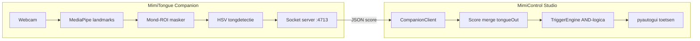

# Onderzoek: Windows tongdetectie als companion-app

**Datum:** juni 2025  
**Project:** MimiControl / Mennens.Tech  
**Doel:** Beoordelen of een lichte, standalone Windows-app naast MimiControl Studio kan draaien die puur op tong reageert — als aanvulling op MediaPipe (dat `tongueOut` mist).

---

## Samenvatting

| Gebaar | Realistische opties op Windows (webcam) | Betrouwbaarheid |
|--------|----------------------------------------|-----------------|
| **Tong uitsteken** | Kleurdetectie (A), custom ML (B), dlib+ORB (C) | Matig–goed (met tuning) |
| **Tong bollen in mond** | `mouthFunnel` via MediaPipe (al in MimiControl), custom ML (B) | Matig (proxy, geen echte tongdetectie) |
| **Lach + tong (AND)** | Combinatie MimiControl blendshapes + companion signaal | Goed op iPad (ARKit); op Windows alleen met companion |

**Eindoordeel:** Bouwen **ja**, maar als **lichte companion** met beperkte scope — niet als vervanging van de iPad-app. Prioriteit blijft iOS/ARKit voor betrouwbare `tongueOut`. Op Windows: companion POC voor **tong uitsteken** via kleurdetectie + mond-open gate; voor **tongbol** blijft `mouthFunnel` in MimiControl de eerste keuze.

**Geschatte complexiteit companion POC:** 2–4 dagen (kleurdetectie + socket-bridge). Productie-kwaliteit met custom ML: 2–4 weken.

---

## Context

MimiControl Studio gebruikt MediaPipe Face Landmarker en levert **51 van 52** ARKit-blendshapes. `tongueOut` ontbreekt structureel in het model ([GitHub issue #4403](https://github.com/google/mediapipe/issues/4403)); in de code is het expliciet uitgeschakeld (`NIET_ONDERSTEUND` in `blendshape_detectie.py`).

De primaire gebruiker (leerling met spasmen) heeft een trigger: **lach + tong** (uitsteken of bollen). Op PC werkt alleen de lach-component betrouwbaar via `mouthSmileLeft/Right`. Tong is de ontbrekende schakel.

---

## Optie A — Kleurdetectie in mondgebied (OpenCV + MediaPipe landmarks)

### Werking

1. MediaPipe levert lip-landmarks (478 punten, lipcontour).
2. Mondregio uitsnijden (convex hull of bounding box rond lip-indices).
3. HSV-kleurruimte: roze/rood segmentatie (tong vs. lip/teint).
4. Drempel op pixelratio of contouroppervlak binnen mond.
5. Optioneel: gate op `jawOpen` of lipafstand (mond moet open zijn).

### Tong uitsteken

| Aspect | Beoordeling |
|--------|-------------|
| Haalbaarheid | **Goed** — tongtip is zichtbaar roze/rood buiten lipcontour |
| Betrouwbaarheid | Matig (60–80% na kalibratie per gebruiker/licht) |
| Latency | Zeer laag (< 30 ms op moderne PC) |
| Dependencies | OpenCV + MediaPipe (al in MimiControl) |

**False positives:** felrode lipstick, fel object bij mond, schaduw in mondhoek, reflectie op tanden.

**Lichtgevoeligheid:** Hoog. Warm/koud licht verschuift HSV-waarden; daglicht vs. TL vereist herkalibratie of adaptieve drempels.

**Referenties:** [Detect tip of tongue using OpenCV](https://zoomout.medium.com/detect-tip-of-tongue-using-opencv-9d15e0b18c3), [tongue-tip-detection-and-tracking](https://github.com/mansikataria/tongue-tip-detection-and-tracking).

### Tong bollen in mond

| Aspect | Beoordeling |
|--------|-------------|
| Haalbaarheid | **Slecht** — tong blijft binnen lipcontour; kleur overlapt met binnenkant mond |
| Betrouwbaarheid | Onbetrouwbaar zonder ML |

Kleurdetectie ziet geen contrast tussen “tong bol in mond” en “mond normaal open”. Geen bruikbare signaalscheiding.

### Conclusie A

- **Tong uitsteken:** realistisch als POC en companion-signaal.
- **Tong bollen:** niet geschikt.

---

## Optie B — Custom ML model

### Bestaande open-source modellen

Er is **geen** kant-en-klare, real-time webcam-model specifiek voor “tong uit” als accessibility-gesture. Bestaande werk richt zich op **tongdiagnose** (Chinese geneeskunde) of **tongtip-tracking**:

| Bron | Type | Relevantie voor MimiControl |
|------|------|----------------------------|
| [changwsh12/Tongue-feature-detection](https://github.com/changwsh12/Tongue-feature-detection) | YOLOv4-tiny, medische tongkenmerken | Laag — andere use case, geen live webcam-gesture |
| [Intelligent-tongue-diagnosis-dataset](https://github.com/m28805746-max/Intelligent-tongue-diagnosis-detection-dataset) | YOLOv8/11, 21 ziektecategorieën | Laag — statische tongfoto's, geen gezicht+gebaar |
| [TD-DFP (MDPI 2025)](https://www.mdpi.com/2079-9292/14/7/1457) | Lightweight tongue region detection | Matig — tong *regio*, niet gebaar-classificatie |
| [PLOS One tongue feature detection](https://journals.plos.org/plosone/article?id=10.1371/journal.pone.0296070) | YOLOv4-tiny, 40+ FPS | Matig — medische context |

### Eigen model trainen (webcam)

**Architectuur-opties:**

| Model | Training | Inference | Geschikt voor |
|-------|----------|-----------|---------------|
| YOLOv8-nano | 500–2000 gelabelde frames | ONNX Runtime, ~30 FPS | Tong zichtbaar (uit) |
| MobileNetV3 binary | 200–500 frames per klasse | TFLite/ONNX, ~60 FPS | Tong uit vs. rust |
| MediaPipe + klein CNN op mond-ROI | 300+ frames | ~40 FPS | Tong uit in mondopening |

**Haalbaarheid training:**

- Data: 10–15 minuten opname per gebaar (uit, bol, rust, lach) = haalbaar in therapeutische setting.
- Labeling: bounding box (tong) of binary klasse (tong_actief / niet).
- Fine-tune op één gebruiker geeft **veel betere** resultaten dan generiek model.
- Export: `model.export(format="onnx")` via Ultralytics.

**Tong uitsteken:** goed haalbaar (geschat 85–95% na user-specific training).

**Tong bollen in mond:** moeilijker — visueel subtiel; vereist mogelijk multi-class (`tong_uit`, `tong_bol`, `rust`) met `mouthFunnel` als extra feature. Haalbaar maar meer data en validatie nodig.

### Conclusie B

- Geen plug-and-play model; **eigen training** is de realistische route.
- Beste langetermijnoptie voor productie op Windows.
- Complexiteit hoger dan kleurdetectie, maar ook beter voor edge cases.

---

## Optie C — dlib / andere face libraries

### dlib (68-punten landmark model)

- Standaard iBUG 300-W model: **68 landmarks**, geen tongpunten.
- Landmarks 48–67 = lipcontour alleen.
- [dlib documentatie](https://www.dlib.net/face_landmark_detection.py.html) bevestigt: mondhoeken, ogen, wenkbrauwen — geen tong.

**Workaround (community):** mond-ROI uitsnijden → ORB keypoints / blob detection → laagste punt = tongtip ([mansikataria](https://github.com/mansikataria/tongue-tip-detection-and-tracking)).

| Aspect | Beoordeling |
|--------|-------------|
| Tong uit | Matig — vergelijkbaar met optie A |
| Tong bol | Niet |
| vs. MediaPipe | MediaPipe heeft meer landmarks (478); dlib voegt weinig toe |

### OpenCV Face Markers LBF/Facemark

- Ook geen tong; vergelijkbaar met dlib.

### MediaPipe Iris / Holistic

- Geen tonglandmarks in Face Mesh V2 ([issue #5857](https://github.com/google-ai-edge/mediapipe/issues/5857)).

### Conclusie C

**Niet geschikt** als primaire oplossing. dlib voegt geen tonglandmarks toe bovenop wat MediaPipe al biedt. ORB/blob-workarounds zijn functioneel equivalent met optie A.

---

## Optie D — Windows-specifieke APIs

### Windows.Media.FaceAnalysis

- `FaceDetector` / `FaceTracker`: alleen **bounding boxes** van gezichten.
- Geen landmarks, geen blendshapes, geen expressies ([Microsoft Learn](https://learn.microsoft.com/en-us/uwp/api/windows.media.faceanalysis?view=winrt-28000)).

### Windows Hello / Biometric Framework

- Gebruikt IR-camera voor authenticatie.
- Landmarks (ogen, neus, mond) voor **identiteit**, niet voor expressie-API's.
- Geen publieke API voor blendshape-scores of tongdetectie ([Windows Hello docs](https://learn.microsoft.com/en-us/windows-hardware/design/device-experiences/windows-hello-face-authentication)).

### Azure Face API / Cognitive Services

- Emotie-detectie (verouderd) en gezichtsattributen; geen `tongueOut`.
- Cloud-afhankelijk; niet geschikt voor real-time accessibility (latency, privacy).

### Conclusie D

**Niet bruikbaar.** Geen Windows-native tongdetectie beschikbaar voor developers.

---

## Optie E — Depth camera / IR (RealSense, Kinect)

### Kinect v2 — [Kv2TongueTracking](https://github.com/TangoChen/Kv2TongueTracking)

- Depth image van mondregio (via face tracking).
- Kleinste depth-waarde in mond = tongtip (closest to sensor).
- Output: `TongueX`, `TongueY` (0–1 binnen mond).

| Aspect | Beoordeling |
|--------|-------------|
| Tong uit | Goed — tong is closest point |
| Tong bol | Slecht — depth verschil minimaal binnen gesloten mond |
| Hardware | Kinect v2 (EOL, Windows-driver nodig) |

### Intel RealSense D415 — [CTU speech therapy thesis](https://dspace.cvut.cz/handle/10467/92942)

- Python-app voor logopedische oefeningen.
- **65% detectie** van oefening-herhalingen (volwassenen + kinderen).
- Vereist RealSense depth camera.

### Multi-camera 3D — [dronefreak/3D-tongue-tip-tracking](https://github.com/dronefreak/3D-tongue-tip-tracking)

- 3 camera's + MATLAB kalibratie + optical flow.
- Academisch; niet geschikt als lichte companion.

### Conclusie E

- **Tong uitsteken:** werkend met depth, maar **specialistische hardware** (€100–400).
- **Tong bollen:** praktisch niet.
- Niet “lichte companion naast standaard webcam-setup” — extra kabel, drivers, kalibratie.
- Alleen zinvol als dedicated accessibility-setup met budget voor hardware.

---

## Optie F — Companion architectuur en MimiControl-integratie

### Ontwerpprincipes

- Companion draait **eigen webcam** OF deelt frames (complexer).
- Output: binair signaal `tongue_detected` (0/1) of continue score `tongue_score` (0.0–1.0).
- MimiControl merge dit als **virtuele blendshape** in trigger-evaluatie.

### Communicatie-opties

| Mechanisme | Pros | Cons | Aanbeveling |
|------------|------|------|-------------|
| **localhost TCP socket** (JSON) | Simpel, cross-process, debugbaar | ~1 ms latency | **Eerste keuze** |
| Named pipe (Windows) | Laag latency, Windows-native | Minder portable | Alternatief |
| UDP | Zeer laag latency | Packet loss | Niet nodig |
| Shared memory | Minimale latency | Complex, sync | Overkill |
| Keyboard hook / virtual key | Geen code-change MimiControl | Alleen binair; geen AND met blendshapes | Fallback |
| Bestand/poll (`tongue.json`) | Trivial | Traag, race conditions | Alleen debug |

### Voorgestelde socket-protocol

```json
// Companion → MimiControl (elke frame of 30 Hz)
{
  "type": "tongue",
  "score": 0.72,
  "method": "hsv",
  "timestamp_ms": 1718640000123
}
```

### Integratie in MimiControl (minimale wijziging)

```
┌─────────────────────┐     JSON/socket      ┌──────────────────────┐
│ MimiTongue Companion│ ──────────────────►  │ MimiControl Studio   │
│ OpenCV + MediaPipe  │   localhost:4713       │ live_modus_explorer  │
│ (mond ROI + HSV)    │                        │                      │
└─────────────────────┘                        │ scores["tongueOut"]  │
                                               │   = companion_score  │
                                               │ (als virtuele BS)    │
                                               └──────────────────────┘
```

**Code-aanpassing (concept):**

1. `blendshape_detectie.py`: optionele `CompanionClient` die `tongueOut` injecteert in score-dict wanneer companion actief.
2. `live_modus_explorer.py`: geen wijziging in trigger-logica — `tongueOut` wordt normale blendshape.
3. Explorer UI: `tongueOut` weer beschikbaar als companion draait (verwijder uit `NIET_ONDERSTEUND` conditioneel).

### Companion-app structuur (POC)

```
mimi-tongue/
├── main.py              # webcam loop, detectie, socket server
├── detect_hsv.py        # kleurdetectie in mond-ROI
├── landmarks.py         # MediaPipe mond-masker
├── config.json          # HSV-drempels, camera-index
└── requirements.txt     # opencv-python, mediapipe (licht)
```

**Geschatte footprint:** < 50 MB Python, geen GUI nodig (optioneel debug-venster).

### Conclusie F

Companion-architectuur is **goed haalbaar** en past bij MimiControl zonder grote refactor. Socket-bridge + virtuele `tongueOut` is de schoonste integratie.

---

## Vergelijking per gebaar

### Tong uitsteken

| Optie | Score | Opmerking |
|-------|-------|-----------|
| A Kleurdetectie | ★★★☆☆ | Snel POC, licht-afhankelijk |
| B Custom ML | ★★★★☆ | Beste langetermijn op webcam |
| C dlib/ORB | ★★☆☆☆ | Geen voordeel vs. A |
| D Windows API | ☆☆☆☆☆ | Niet beschikbaar |
| E Depth camera | ★★★★☆ | Goed maar extra hardware |
| F Companion + A/B | ★★★★☆ | Aanbevolen aanpak |
| **iPad ARKit** | ★★★★★ | Native `tongueOut` — beste optie |

### Tong bollen in mond

| Optie | Score | Opmerking |
|-------|-------|-----------|
| A Kleurdetectie | ★☆☆☆☆ | Niet werkbaar |
| B Custom ML | ★★★☆☆ | Mogelijk met user-specific data |
| MediaPipe `mouthFunnel` | ★★★☆☆ | **Al in MimiControl** — eerste proxy |
| MediaPipe `cheekPuff` | ★★☆☆☆ | Soms correleert met tongbol |
| E Depth | ★☆☆☆☆ | Geen depth-contrast |
| **iPad `mouthFunnel` + `tongueOut`** | ★★★★☆ | AND-trigger op iPad |

---

## Aanbeveling

### Bouwen ja/nee?

**Ja** — als lichte companion POC, **parallel** aan iPad-ontwikkeling (niet als blocker).

| Prioriteit | Actie |
|------------|-------|
| **1 (hoog)** | iPad-app met ARKit `tongueOut` — primaire oplossing |
| **2 (middel)** | Windows companion POC: HSV + mond-open gate → socket → virtuele `tongueOut` |
| **3 (laag)** | Custom YOLO/binary classifier als HSV onvoldoende is |
| **4 (optioneel)** | Depth camera alleen bij dedicated setup met budget |

### Aanbevolen aanpak (companion POC)

1. **Week 1:** `mimi-tongue` — MediaPipe mond-ROI + HSV-tongdetectie + debug-overlay.
2. **Week 1:** Socket server op `localhost:4713`; MimiControl `CompanionClient`.
3. **Week 2:** Kalibratie-UI in companion (HSV sliders) + test met primaire gebruiker.
4. **Evaluatie:** Als false positives > 20% → start custom MobileNetV3 training.

### Geschatte complexiteit

| Fase | Duur | Resultaat |
|------|------|-------------|
| POC (A + F) | 2–4 dagen | Tong uit detectie + MimiControl-integratie |
| Kalibratie + tuning | 3–5 dagen | Per-gebruiker drempels |
| Custom ML (B) | 2–4 weken | Productie-kwaliteit tong uit |
| Tong bol via ML | +2–3 weken | Experimenteel; `mouthFunnel` blijft fallback |

### Proof-of-concept architectuur



**Trigger-voorbeeld (na integratie):**

```json
{
  "naam": "Lach + tong uit",
  "blendshapes": {
    "mouthSmileLeft": 0.4,
    "mouthSmileRight": 0.4,
    "tongueOut": 0.5
  },
  "toetsen": ["space"]
}
```

`mouthSmileLeft/Right` van MediaPipe; `tongueOut` van companion.

---

## Risico's en mitigatie

| Risico | Impact | Mitigatie |
|--------|--------|-----------|
| Twee webcam-apps | Camera conflict | Companion gebruiktzelfde camera-index; of één proces |
| Lichtgevoeligheid HSV | False triggers | Per-profiel HSV-kalibratie; adaptive threshold |
| Tong bol niet detecteerbaar | Trigger werkt niet | iPad met `mouthFunnel`; ML experiment |
| Spasmen / snelle bewegingen | False positives | Vasthoudtijd + cooldown (al in MimiControl) |
| Companion crash | Geen tongsignaal | Graceful: `tongueOut` = 0, waarschuwing in UI |

---

## Conclusie

Op Windows is **echte tongdetectie** niet beschikbaar via MediaPipe of OS-API's. Een **aparte companion-app** is technisch haalbaar en past in de MimiControl-architectuur via een socket-bridge die `tongueOut` als virtuele blendshape injecteert.

- **Tong uitsteken:** realistisch met kleurdetectie (POC) of custom ML (productie).
- **Tong bollen:** niet met kleur/depth; gebruik `mouthFunnel` in MimiControl of train custom classifier; iPad/ARKit is superieur.

De **iPad-app met ARKit** blijft de strategische prioriteit voor betrouwbare tongdetectie. De Windows companion is een **nuttige brug** voor PC-gebruik tot de iPad-deployment live is, en als aanvulling voor gebruikers die op Windows blijven.

---

## Referenties

- [MediaPipe tongueOut issue #4403](https://github.com/google/mediapipe/issues/4403)
- [MediaPipe tongue tracking feature request #5857](https://github.com/google-ai-edge/mediapipe/issues/5857)
- [Apple ARKit blendShapes — tongueOut](https://developer.apple.com/documentation/arkit/arfaceanchor/blendshapelocation)
- [Tongue tip detection (OpenCV)](https://github.com/mansikataria/tongue-tip-detection-and-tracking)
- [Kinect v2 tongue tracking](https://github.com/TangoChen/Kv2TongueTracking)
- [RealSense speech therapy (CTU)](https://dspace.cvut.cz/handle/10467/92942)
- MimiControl: `app/blendshape_detectie.py`, `app/live_modus_explorer.py`
